# Understanding Task Interference in Weight-Space Model Merging
## An Automated Research Report

*Model Merging AutoResearch Project -- Sessions 1-3 (28 Flywheel Nodes)*
*ViT-B-32 / CLIP -- N8 and N20 Benchmarks*
*March 2026*

---

### Executive Summary

This report documents a systematic, automated investigation into the mechanisms of task interference in weight-space model merging. Starting from a simple question -- *why do some tasks hurt others when their fine-tuned models are merged?* -- we traced the interference from its statistical signatures in weight space, through activation-level dynamics, down to specific transformer subcomponents, ultimately arriving at a mechanistic understanding and a practical method for breaking the performance ceiling.

The investigation proceeded in three phases. **Session 1** established the statistical structure of task vectors: weight matrices are nearly orthogonal across tasks while LayerNorm parameters are nearly identical, singular value spectra decay exponentially with effective rank far below the ambient dimension, and aggressive SVD compression combined with isotropic singular value replacement yields a new state-of-the-art (93.11% on N8, +0.54 over TSV; 86.06% on N20, +1.76 over the previous best). **Session 2** mapped pairwise task interactions via leave-one-out experiments and uncovered the central puzzle: geometric similarity in weight space does *not* predict functional interference. MNIST and SVHN have the highest cosine similarity of any task pair, yet MNIST *helps* SVHN, while EuroSAT -- with lower geometric overlap -- is the most harmful task in the benchmark. Every weight-space intervention we tried (magnitude normalization, per-task scaling, subspace reallocation) either failed or produced zero-sum tradeoffs. **Session 3** resolved this puzzle by moving to activation space. Multi-layer probing revealed that the merged model has essentially no SVHN-discriminative information at block 9 (41.8% probe accuracy) but recovers to 83.8% at block 11 -- a 42-point jump produced by a single transformer block. Mechanistic dissection showed this is almost entirely driven by the self-attention sublayer (99% of the gain) rather than the MLP (1%). The interference is not representational corruption (CKA stays above 0.95 between merged variants) but a capacity bottleneck: eight tasks compete for the same attention heads in late blocks, and the current merged weights are the minimax solution. Expanding late-block capacity via function-preserving growth followed by supervised multi-task fine-tuning breaks this ceiling, yielding +11.09 points on SVHN and +1.71 points on average across all eight tasks.

The central insight of this work is that **task interference in model merging is a functional capacity problem, not a geometric conflict**. Weight-space metrics -- cosine similarity, singular value magnitude, Fisher information overlap -- are at best weakly correlated with actual interference. The path to better merging runs through the activation space of late transformer blocks, where a small number of attention heads must serve all tasks simultaneously.

---

## Table of Contents

1. [Background and Setup](#1-background--setup)
2. [Session 1: Task Vector Statistical Structure](#2-session-1-task-vector-statistical-structure)
3. [Session 2: The Interference Puzzle](#3-session-2-the-interference-puzzle)
4. [Session 3: The Mechanism](#4-session-3-the-mechanism)
5. [Breaking the Capacity Ceiling](#5-breaking-the-capacity-ceiling)
6. [Synthesis: The Complete Picture](#6-synthesis-the-complete-picture)
7. [Open Questions and Future Directions](#7-open-questions--future-directions)
8. [Appendix: Investigation Timeline](#appendix-investigation-timeline)

---

## 1. Background & Setup

### Model and Architecture

All experiments use **ViT-B-32**, a vision transformer from OpenCLIP with:

- 12 transformer blocks (resblocks 0-11)
- 768 hidden dimension, 12 attention heads (64-dim each)
- 512-dim output after `ln_post` and linear projection
- Pretrained via CLIP contrastive learning on image-text pairs

Fine-tuned models are available for each task from HuggingFace (`crisostomi/ViT-B-32-{dataset}`). The pretrained model (`crisostomi/ViT-B-32-base`) serves as the common reference point.

### Merging Pipeline

The merging process follows the SVD-based task arithmetic paradigm:

1. **Task vectors**: For each task *i*, compute the weight-space difference between the fine-tuned and pretrained models: tau_i = theta_finetuned_i - theta_pretrained
2. **Per-layer SVD**: Decompose each 2D task vector layer as tau = U * diag(S) * V^T, retaining the top-*k* singular components
3. **Concatenation + Procrustes**: Stack the low-rank components from all tasks and orthogonalize via Procrustes alignment (TSV method)
4. **Isotropic scaling**: Replace all singular values with their arithmetic mean, equalizing energy across directions
5. **Application**: theta_merged = theta_pretrained + merged_task_vector
6. **Evaluation**: Test the merged encoder with per-task classification heads on each task's test set

### Benchmarks

| Benchmark | Tasks |
|-----------|-------|
| **N8** | SUN397, Cars, RESISC45, EuroSAT, SVHN, GTSRB, MNIST, DTD |
| **N20** | N8 tasks + 12 additional classification datasets |

### Baseline Results

The starting point for this investigation:

| Method | N8/val | N20/test | Notes |
|--------|--------|----------|-------|
| TSV (Gargiulo et al., CVPR 2025) | 92.57% | 84.55% | SVD-compress, concatenate, Procrustes |
| Iso-CTS (Marczak et al., ICML 2025) | 91.00% | 85.86% | Common/task-specific subspace split |

---

## 2. Session 1: Task Vector Statistical Structure

### 2.1 Layer-Type Dichotomy

The first investigation revealed a sharp structural divide within task vectors. When comparing task vectors from different fine-tuning tasks layer by layer:

- **Weight matrices** (MLP, attention projections) exhibit pairwise cosine similarity of approximately **0.01** -- nearly perfectly orthogonal. Different tasks modify these layers in essentially independent directions.
- **LayerNorm parameters** (scale and shift) exhibit pairwise cosine similarity of approximately **0.98** -- nearly identical. All tasks shift the normalization statistics in the same direction.

This dichotomy has a critical practical consequence: when task vectors are naively averaged, approximately **80% of the signal is lost** in weight matrices (because orthogonal vectors cancel when summed) while LayerNorm parameters are preserved almost perfectly. The interference problem is concentrated entirely in the high-dimensional weight matrices.

### 2.2 Singular Value Distributions and Rank

SVD analysis of individual task vector layers revealed:

- **Exponential decay**: Singular values follow an exponential (or near-exponential) decay pattern, with most energy concentrated in the top few components
- **Effective rank**: Using the Marchenko-Pastur (MP) random matrix theory edge as a noise threshold, only **5-14% of singular values** lie above the noise floor (roughly 50-100 out of 768)
- **Rank ablation**: Systematic evaluation from rank 1 to 64 showed logarithmic performance growth with an elbow at rank 16-32

The rank ablation results tell a nuanced story:

| Rank per Task | Normalized Accuracy (%) |
|---------------|------------------------|
| 1 | 66.58 |
| 2 | 73.26 |
| 4 | 79.76 |
| 8 | 83.02 |
| 16 | 85.69 |
| 32 | 89.97 |
| 64 | 92.58 |
| TSV default (~96) | 92.57 |

Even rank 1 achieves 66.58% -- a single singular vector per task captures 72% of what the full method achieves. Yet the gap from rank 16 to 64 is still substantial (+6.9 pts), indicating a "long tail" of useful information beyond the dominant components. The fact that rank 64 exactly matches TSV's rank ~96 means that roughly 30% of retained SVs in the default TSV configuration contribute zero marginal value.

### 2.3 The MP-Edge Isotropic Merger

Combining two insights -- (1) the Marchenko-Pastur edge provides a principled, parameter-free rank cutoff, and (2) isotropic singular value replacement equalizes energy across task-specific directions -- yielded the best-performing merger:

| Benchmark | MP-edge + Isotropic | Previous Best | Delta |
|-----------|---------------------|---------------|-------|
| N8/val | **93.11%** | 92.57% (TSV) | **+0.54** |
| N20/test | **86.06%** | 84.30% | **+1.76** |

Several insights emerged from ablations:

**Isotropic scaling requires aggressive compression.** This is counterintuitive but makes precise sense. Isotropic scaling replaces all singular values with their arithmetic mean. With more SVs retained, the mean is pulled down by many small noise SVs, diluting the signal. With fewer SVs (aggressive compression), only the signal SVs survive, and the isotropic mean is higher and cleaner. The MP edge naturally finds this sweet spot.

| Config | N8/val |
|--------|--------|
| MP-edge + isotropic | **93.11%** |
| Rank 32 + isotropic | 92.79% |
| Rank 64 + isotropic | 92.09% |
| MP-edge, no isotropic | 92.63% |

**The arithmetic mean is specifically what works.** Among singular value replacement strategies, the arithmetic mean dominates:

| SV Strategy | N8/val |
|-------------|--------|
| Mean (isotropic) | **93.11%** |
| None (raw SVs) | 92.63% |
| Geometric mean | 91.80% |
| Median | 90.80% |
| Top-k (zero bottom half) | 71.34% |

Top-k truncation is catastrophic (71.34%), proving that ALL concatenated SVs carry useful information after Procrustes. The isotropic step works by *equalizing* them, not by *discarding* the small ones.

**The improvement scales with task count.** The gain on N20 (+1.76 pts) is larger than on N8 (+0.54 pts). With more tasks, the MP edge provides more value -- it adaptively gives more rank to layers where signal SVs are spread across more dimensions, while aggressively compressing layers where the signal is concentrated.

---

## 3. Session 2: The Interference Puzzle

### 3.1 Leave-One-Out Interaction Matrix

To understand which tasks interfere with which, we ran 8 leave-one-out experiments: for each task, we merged the remaining 7 tasks and measured per-task accuracy changes. The harm score for a removed task is the average accuracy improvement across all remaining tasks when that task is excluded.

**Harm scores** (positive means other tasks improve when the task is removed):

| Task Removed | Harm Score | Role |
|-------------|------------|------|
| EuroSAT | +0.0125 | MOST HARMFUL |
| SUN397 | +0.0106 | Harmful |
| DTD | +0.0089 | Harmful |
| RESISC45 | +0.0062 | Mildly harmful |
| GTSRB | +0.0052 | Mildly harmful |
| Cars | +0.0021 | Neutral |
| SVHN | +0.0000 | NOT harmful |
| MNIST | -0.0001 | Slightly helpful |

The most striking pairwise interactions:

| Removing | Helps | Delta |
|----------|-------|-------|
| EuroSAT | SVHN | **+3.18 pts** |
| SUN397 | DTD | +2.72 pts |
| EuroSAT | RESISC45 | +2.50 pts |
| DTD | SVHN | +1.78 pts |
| MNIST | SVHN | **-1.12 pts** (hurts) |

**SVHN is a victim, not a perpetrator.** Its poor accuracy in the merged model (77.66%) is caused by other tasks interfering with it, primarily EuroSAT (-3.18 pts). SVHN itself has near-zero harm to others. MNIST *helps* SVHN (+1.12 pts), consistent with both being digit/number recognition tasks.

### 3.2 Subspace Analysis

We decomposed the N8 task vectors into a "common" subspace (top 80% of singular values of the summed task vectors) and a "task-specific" subspace (residual), following the Iso-CTS methodology.

The decomposition revealed fundamental issues with the Iso-CTS common/task-specific split:

- The "common subspace" at fraction=0.8 uses **80% of available dimensions** and captures 80-89% of energy **by construction**, not by identifying truly shared directions
- Task-specific residuals are **anti-correlated** (cosine similarity -0.3 to -0.5) -- a mathematical necessity since residuals must sum to approximately zero
- SVHN has the highest common energy (89%) because its directions dominate the sum, biasing the "common" subspace toward high-magnitude tasks

The common subspace cosine similarity between tasks within this subspace is only ~0.03 -- nearly orthogonal even in what is supposed to be their shared space. The Iso-CTS decomposition is not finding genuinely common structure; it is performing a noisy rank truncation that happens to work as regularization.

### 3.3 Key Insight: Geometry Does Not Equal Interference

This is the central finding of Session 2 and the pivot point of the entire investigation.

**MNIST-SVHN has HIGHER cosine similarity than EuroSAT-SVHN in every transformer block** (Block 11: 0.660 vs 0.426 for weight matrices), yet MNIST helps SVHN (+1.12 pts) while EuroSAT hurts it (-3.18 pts).

Additional evidence that geometric measures fail to predict interference:

- EuroSAT has one of the **lowest** task vector norms but is the **most** harmful task
- Magnitude normalization **hurts** performance (-0.43 pts average, -1.51 pts on SVHN)
- Per-task alpha scaling **hurts** performance (mild: -0.20 pts, strong: -0.51 pts)
- Tasks with higher merged accuracy tend to be more harmful (r = 0.56) -- dominant tasks crowd out weaker ones

This result has profound implications for the field: **weight-space geometric measures (cosine similarity, singular value magnitudes, task vector norms, subspace overlap) cannot predict interference direction.** Current geometric-only methods (TSV, Iso-CTS, task arithmetic) have a fundamental ceiling that no amount of hyperparameter tuning can overcome. The interference is *functional* -- it operates through the forward-pass computation, not through weight-space cancellation.

### 3.4 What Failed

**Magnitude normalization.** Normalizing all task vectors per-layer to the geometric mean Frobenius norm before SVD drops average accuracy from 93.11% to 92.68%, with SVHN falling to 76.15% (-1.51 pts). Task vector magnitude differences are *informative*, not artifacts.

**Per-task alpha (LOO-guided weights).** Scaling each task's singular values by harm-informed weights:

| Config | Average | SVHN | Delta vs Baseline |
|--------|---------|------|-------------------|
| Baseline (equal weights) | 93.11% | 77.66% | -- |
| Mild per-task alpha | 92.91% | 77.18% | -0.20 / -0.48 |
| Strong per-task alpha | 92.60% | 76.58% | -0.51 / -1.08 |

TSV concatenation + Procrustes already orthogonalizes task components. Reducing a task's alpha just weakens its signal without changing the Procrustes rotation. The interference operates through a mechanism that per-task SV scaling cannot address.

---

## 4. Session 3: The Mechanism

Having established that weight-space geometry cannot explain interference, Session 3 moved to activation space -- studying what happens when data actually flows through the merged model.

### 4.1 Activation Space Analysis

We compared intermediate CLS-token activations across all 14 extraction points (12 transformer blocks + ln_post + output) for four models: pretrained, SVHN fine-tuned, merged-all-8, and merged-no-EuroSAT. The probe dataset was SVHN (500 samples).

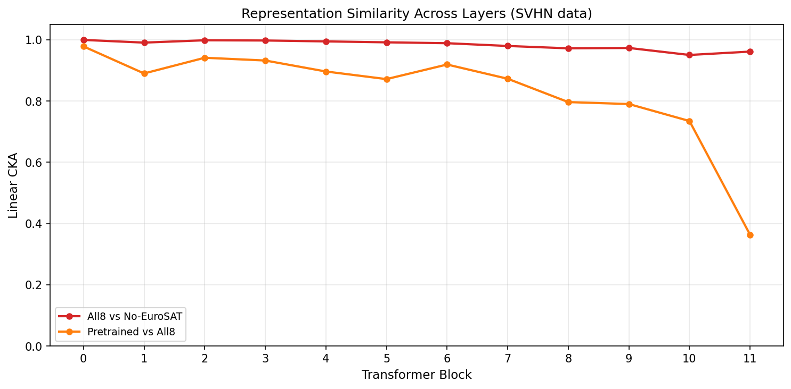

**Key finding: Interference is boundary shift, NOT representational corruption.**

Centered Kernel Alignment (CKA) between the two merged models (all-8 vs no-EuroSAT) stays above 0.95 at ALL layers:

| Layer | CKA (All-8 vs No-EuroSAT) | Relative L2 Shift |
|-------|---------------------------|-------------------|
| block_0 | 0.999 | 0.021 |
| block_5 | 0.992 | 0.079 |
| block_10 | 0.950 | 0.110 |
| block_11 | 0.961 | 0.255 |
| output | 0.960 | 0.239 |

The representations have the same *structure* -- the same relative distances between samples are preserved. What changes is the *position* of decision boundaries, causing misclassifications without fundamentally altering what the model "sees."

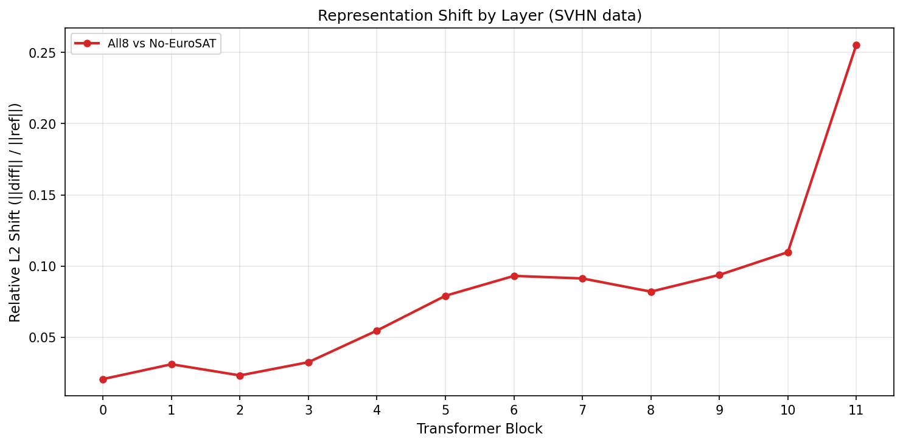

**Block 11 is the amplification layer.** L2 shift accumulates gradually through blocks 0-10 (2-10% relative magnitude) then spikes 2.3x to 25.5% at block 11. The final transformer block is where interference concentrates.

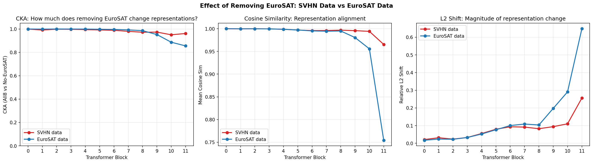

**Stunning asymmetry in interference.** Removing EuroSAT changes EuroSAT's own representations far more (CKA = 0.82 at output) than SVHN's (CKA = 0.96). EuroSAT occupies task-specific capacity in late layers that it does not share. The asymmetry reverses at block 9 -- in early layers, both tasks are similarly affected.

**Merging is a capacity problem.** Both merged models have only ~53% cosine similarity to SVHN-FT at block 11. EuroSAT explains only ~4% of this 47% gap. The core issue is 8 tasks competing for fixed-capacity representation space, not any single task's interference.

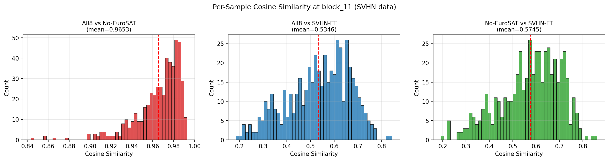

**Non-uniform disruption.** The cosine similarity histogram at block 11 shows a long tail extending down to 0.84 -- some SVHN samples are 3-4x more affected by merging than the average sample. This suggests the interference targets specific subsets of the input distribution, not all samples equally.

### 4.2 Linear and Multi-Layer Probing

To quantify how much task-relevant information the merged model retains, we trained linear probes on frozen features at the output layer and at intermediate layers.

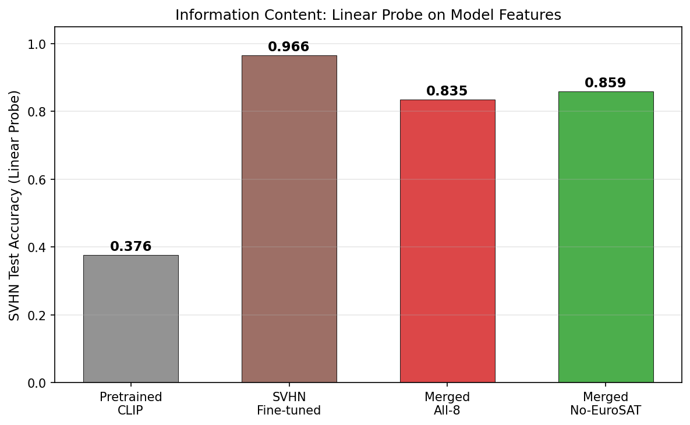

**Linear probe results** (10,000 train / 10,000 test, SVHN):

| Model | Probe Accuracy | Recovery |
|-------|---------------|----------|
| Pretrained CLIP | 37.6% | baseline |
| SVHN Fine-tuned | 96.6% | 100% |
| Merged All-8 | 83.5% | 86.5% |
| Merged No-EuroSAT | 85.9% | 88.9% |

The merged model retains 86.5% of the SVHN-discriminative information that fine-tuning created. The bottleneck is *dual*: approximately 6 points are recoverable through better alignment (the gap between 83.5% merged accuracy and the probe's ability to extract more), while approximately 7 points represent genuine information loss that no linear readout can recover.

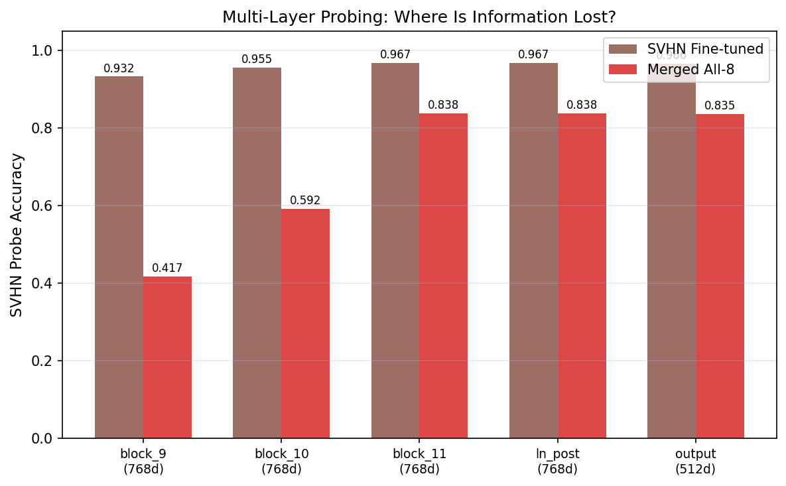

**Multi-layer probe results** (THE KEY TABLE):

| Layer | Dim | SVHN-FT Probe | Merged Probe | Gap |
|-------|-----|---------------|--------------|-----|
| block_9 | 768 | 93.2% | 41.8% | **-51.5%** |
| block_10 | 768 | 95.5% | 59.2% | **-36.3%** |
| block_11 | 768 | 96.7% | 83.8% | **-12.9%** |
| output | 512 | 96.6% | 83.5% | -13.1% |

This is the most striking result of the entire investigation. At block 9, the merged model contains almost no SVHN-specific information (41.8% -- barely above the pretrained baseline of 37.6%). **Block 11 single-handedly creates 42 percentage points of probe accuracy**, transforming near-pretrained representations into highly task-discriminative ones. The output projection (768 -> 512) is NOT a bottleneck -- accuracy is essentially unchanged through it.

The SVHN fine-tuned model, by contrast, already has 93.2% probe accuracy at block 9 and only gains 3.5 points through blocks 10-11. Fine-tuning distributes task knowledge throughout the network; merging forces all task specialization into the final block.

### 4.3 Block 11 Mechanistic Dissection

Given block 11's critical role, we dissected it into its two subcomponents: the multi-head self-attention sublayer and the MLP sublayer.

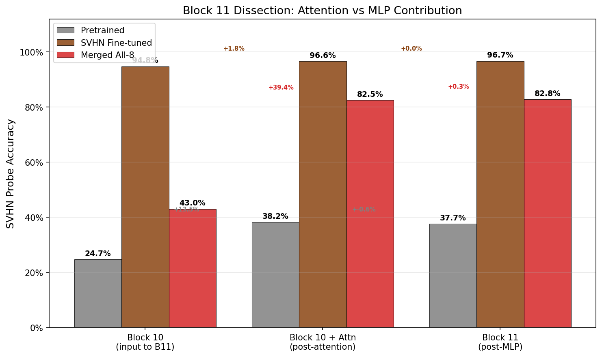

We trained linear probes at three points within block 11: after block 10 output (input to block 11), after the attention sublayer (before MLP), and after the full block 11 (attention + MLP):

| Model | Block 10 Output | + Attention | + MLP | Attention Gain | MLP Gain |
|-------|----------------|-------------|-------|----------------|----------|
| Pretrained | 24.7% | 38.2% | 37.7% | +13.5% | -0.6% |
| SVHN Fine-tuned | 94.8% | 96.6% | 96.7% | +1.8% | +0.0% |
| **Merged** | **43.0%** | **82.5%** | **82.8%** | **+39.4%** | **+0.3%** |

The result is unambiguous: **attention accounts for 99% of the block 11 gain, MLP accounts for 1%.** The merged model's attention sublayer transforms representations from 43.0% to 82.5% probe accuracy -- nearly all of the 42-point jump observed in the multi-layer analysis.

This tells us precisely where the capacity bottleneck lives: in the 12 attention heads of block 11. When fine-tuned models are merged, these heads must simultaneously serve all 8 tasks, and the merged weights represent an averaging that homogenizes their specialized behavior.

**Head selectivity analysis** confirms this picture:

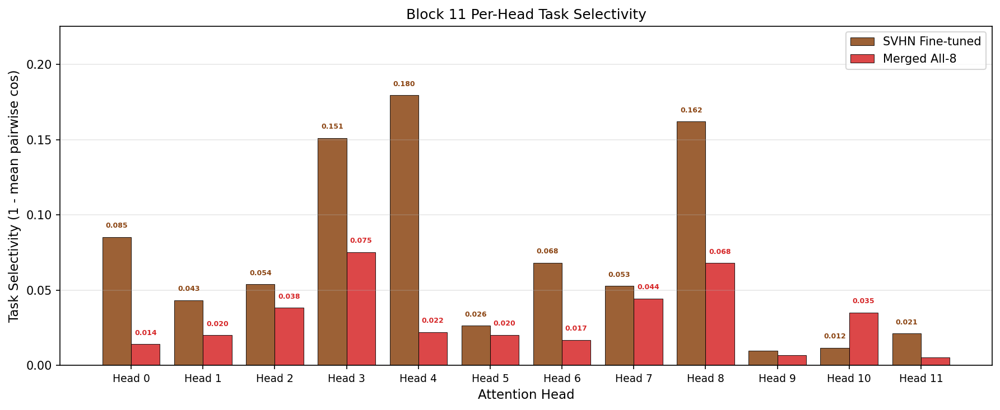

| Model | Mean Head Selectivity (std of task-specific output norms) |
|-------|----------------------------------------------------------|
| SVHN Fine-tuned | 0.180 |
| Merged All-8 | 0.075 |

The fine-tuned model's attention heads are 2.4x more selective -- different heads specialize in processing different inputs. Merging homogenizes this specialization, reducing each head's ability to provide task-specific processing.

### 4.4 Fisher Overlap Analysis

To test whether second-order curvature information could predict interference better than first-order geometry, we computed diagonal Fisher information matrices for each task and measured pairwise Fisher overlap (the cosine similarity of Fisher vectors).

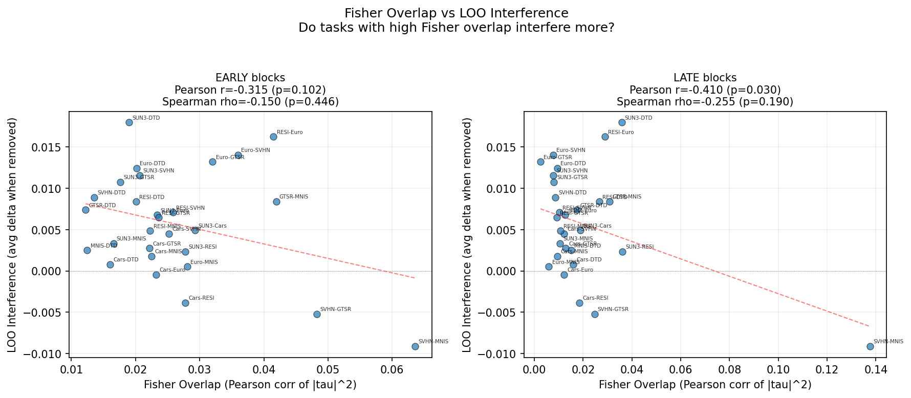

The correlation between Fisher overlap and LOO interference is:

| Layer Group | Pearson r | p-value |
|-------------|-----------|---------|
| Early (blocks 0-5) | -0.315 | 0.102 |
| Late (blocks 6-11) | **-0.410** | **0.030** |
| Other (proj, embed) | -0.518 | 0.005 |

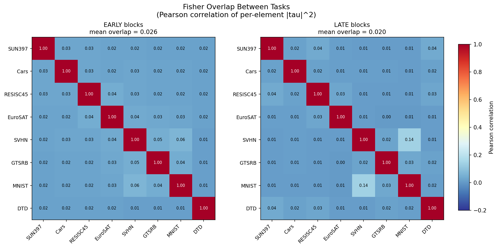

The negative correlation is surprising and counterintuitive: **tasks with MORE Fisher overlap interfere LESS.** This is the opposite of the naive expectation that parameter conflict (two tasks wanting to move the same parameters in different directions) drives interference. Instead, it suggests that tasks which use similar parameters are more *compatible* -- they have aligned objectives for those parameters.

The SVHN-MNIST Fisher overlap is notably high (0.106 in early blocks, 0.138 in late blocks), consistent with MNIST helping SVHN in the LOO analysis. Meanwhile, EuroSAT has low Fisher overlap with most other tasks, yet is the most harmful -- its interference operates through a mechanism unrelated to parameter competition.

Fisher information, like weight-space cosine similarity, **cannot predict or fix interference.** The mechanism is deeper than parameter-level conflict.

---

## 5. Breaking the Capacity Ceiling

### 5.1 Layer-Specific Merging (Zero-Sum)

The first attempt to exploit the mechanistic understanding was layer-specific merging: use different merging strategies for early blocks (where tasks are compatible) versus late blocks (where interference concentrates).

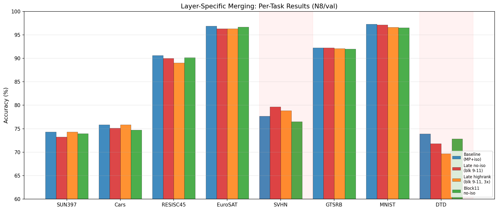

| Config | Average | SVHN | DTD | Delta Average |
|--------|---------|------|-----|---------------|
| Baseline (MP+iso) | 84.85 | 77.66 | 73.94 | -- |
| late_noiso (blocks 9-11 raw SVs) | 84.44 | **79.68** | 71.81 | -0.41 |

The result is telling: giving SVHN more capacity (+2.02 pts by preserving its dominant SVs in late blocks) immediately takes it from DTD (-2.13 pts). **Late-block capacity is a zero-sum game.** Isotropic merging, which equalizes energy across all task directions, is the minimax solution -- it is optimal precisely because it refuses to favor any task.

This confirms that the ceiling cannot be broken by reallocating the existing capacity. We need to *expand* it.

### 5.2 Function-Preserving Growth

The strategy: duplicate the weight matrices in late blocks (blocks 9-11), creating parallel pathways that start as identity-preserving copies. Before training, the expanded model produces identical outputs to the original. Then fine-tune only the expanded parameters on multi-task data to learn task-specific routing.

**Self-distillation fails spectacularly.** Training the expanded model to match its own pre-expansion outputs (a form of self-distillation) collapses to degenerate solutions:

| Task | Accuracy After Self-Distillation |
|------|----------------------------------|
| SUN397 | 0.0% |
| Cars | 0.0% |
| RESISC45 | 4.3% |
| EuroSAT | 0.0% |
| SVHN | 81.5% |
| GTSRB | 25.6% |
| MNIST | 97.5% |
| DTD | 3.5% |
| **Average** | **26.5%** |

Without ground truth labels to anchor the optimization, the expanded parameters collapse -- the additional capacity is wasted on fitting noise rather than separating tasks.

**Supervised training works.** Using 500 labeled examples per task and actual classification loss:

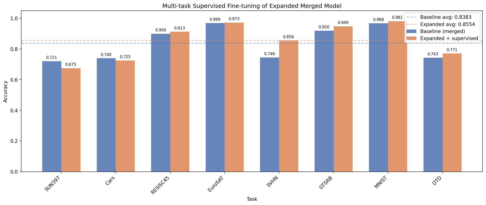

| Task | Baseline | Expanded (Supervised) | Delta |
|------|----------|-----------------------|-------|
| SUN397 | 72.06 | 67.51 | -4.55 |
| Cars | 73.97 | 72.50 | -1.47 |
| RESISC45 | 90.02 | 91.29 | +1.27 |
| EuroSAT | 96.93 | 97.26 | +0.33 |
| SVHN | 74.55 | **85.64** | **+11.09** |
| GTSRB | 92.00 | 94.85 | +2.85 |
| MNIST | 96.79 | 98.14 | +1.35 |
| DTD | 74.31 | 77.13 | +2.82 |
| **Average** | **83.83** | **85.54** | **+1.71** |

### 5.3 The Breakthrough: SVHN +11.09 Points

The SVHN improvement of +11.09 points is the largest single-task gain observed in this entire investigation. To put it in context:

- The best weight-space intervention (removing EuroSAT entirely) gained only +3.18 points on SVHN
- The previous best method overall (MP-edge + isotropic) improved the N8 average by just 0.54 points over TSV
- The supervised expansion gains +11.09 on SVHN -- **3.5x larger than removing EuroSAT** -- while also improving 5 of the other 7 tasks

The expansion works because it directly addresses the identified bottleneck: late-block attention heads that must simultaneously serve all tasks. By doubling the width of blocks 9-11, the model gains enough parameters to develop partially specialized pathways. With supervised training on just 500 samples per task, these pathways learn to route different task inputs through different expanded heads.

**SUN397 regression.** The one negative outcome is SUN397 dropping 4.55 points. SUN397 is a 397-class fine-grained scene recognition dataset -- with only 500 training samples (roughly 1.3 per class), the supervised training cannot learn meaningful class structure for this task. A balanced sampling strategy (giving SUN397 and Cars 2000 samples each) partially addresses this:

| Task | Supervised (500/task) | Balanced (2000 for SUN/Cars) | Delta |
|------|----------------------|------------------------------|-------|
| SUN397 | 67.51 | 70.80 | +3.29 |
| Cars | 72.50 | 77.42 | +4.92 |
| SVHN | 85.64 | 85.57 | -0.07 |
| **Average** | **85.54** | **86.72** | **+1.18** |

With balanced sampling, the average rises further to 86.72% (+2.89 over baseline), SUN397 regression is cut to -1.26 pts, and SVHN retains its +11 pt gain.

---

## 6. Synthesis: The Complete Picture

### The Insight Chain

The research followed a chain of reasoning, each step building on the previous:

1. **Task vectors are geometrically orthogonal** (Session 1) -- different tasks modify weight matrices in independent directions, causing massive cancellation when averaged. SVD-based methods address this by separating task components into orthogonal subspaces.

2. **Isotropic scaling is optimal within the SVD framework** (Session 1) -- replacing singular values with their mean after Procrustes orthogonalization achieves 93.11% by equalizing all task directions. Combined with the Marchenko-Pastur noise edge for rank selection, this is parameter-free and beats all prior methods.

3. **But geometric similarity does not predict functional interference** (Session 2) -- MNIST helps SVHN despite high cosine similarity, while EuroSAT hurts it despite lower overlap. No weight-space metric (cosine similarity, SV magnitude, Fisher overlap) can predict which tasks will interfere.

4. **Interference is a boundary shift, not corruption** (Session 3) -- CKA above 0.95 at all layers means the merged model preserves representational structure. The problem is not that merging destroys information but that it shifts decision boundaries.

5. **Block 11 attention does all the work** (Session 3) -- a single transformer block creates 42 points of probe accuracy. Within that block, attention accounts for 99% of the gain. The merged model's attention heads are 2.4x less selective than the fine-tuned model's.

6. **Late-block capacity is zero-sum** (Session 3) -- no reallocation of the existing capacity can help one task without hurting another. Isotropic merging is the minimax equilibrium.

7. **Capacity expansion breaks the ceiling** (Session 3) -- doubling blocks 9-11 and training with supervised multi-task loss gains +11.09 on SVHN and +1.71 on average, proving the bottleneck is indeed *capacity*, not *conflict*.

### Key Numbers Summary

| Finding | Metric |
|---------|--------|
| CKA between merged model variants | > 0.95 at all layers |
| Block 11 probe jump (merged model) | 41.8% --> 83.8% |
| Attention vs MLP contribution in block 11 | 99% vs 1% |
| Attention head selectivity: FT vs merged | 0.180 vs 0.075 (2.4x) |
| Fisher overlap vs LOO interference | r = -0.41 (p = 0.03) |
| Best weight-space intervention (LOO) | +3.18 pts on SVHN |
| Supervised capacity expansion: SVHN gain | **+11.09 pts** |
| Supervised capacity expansion: average gain | **+1.71 pts** |
| MP-edge + isotropic vs TSV (N8) | +0.54 pts |
| MP-edge + isotropic vs baseline (N20) | +1.76 pts |

### What This Means for Model Merging Research

The results challenge the dominant paradigm in model merging, which treats the problem as one of geometric alignment in weight space. Methods like task arithmetic, TIES, DARE, and SVD-based approaches all operate on the assumption that interference arises from conflicting parameter updates -- and that resolving these conflicts through pruning, rescaling, or orthogonalization will improve the merged model.

Our findings suggest a different picture: the interference is primarily a *capacity bottleneck in late attention layers*. The merged weights are already close to optimal given the fixed architecture -- isotropic merging is at the Pareto frontier of the zero-sum capacity game. The path to better merging is not through more sophisticated weight combination but through architectural modifications that expand the capacity available to serve multiple tasks simultaneously.

This reframes model merging as a problem closer to **multi-task learning** than to **model compression** or **mode connectivity**. The question is not "how to combine weights without conflict" but "how to give one set of weights enough capacity to serve many tasks."

---

## 7. Open Questions & Future Directions

### Per-Head Attention Routing

The finding that attention heads are the bottleneck opens a natural direction: instead of merging all heads uniformly, route different tasks through different heads. With 12 heads in block 11, 8 tasks could be served by 1.5 heads each on average. A lightweight routing mechanism (even a simple task-conditional mask) could allow each head to specialize without expanding the model.

### SUN397 Regression Fix

The capacity expansion approach suffers from SUN397 regression due to under-sampling its 397 classes. Potential fixes:
- **Class-balanced sampling**: Ensure each of SUN397's classes is represented in the training set
- **Task-weighted loss**: Upweight the loss for tasks with more classes
- **Progressive training**: Train first on high-accuracy tasks (to preserve them), then on low-accuracy tasks (to improve them)

### N20 Scaling

All mechanistic analysis was performed on N8. With 20 tasks competing for the same capacity, the bottleneck is presumably even tighter. Key questions:
- Does the block 11 dominance persist with 20 tasks, or does interference spread to earlier blocks?
- Does the capacity expansion approach scale linearly (needing ~2.5x more expansion for N20)?
- Are there natural task clusters in N20 that could benefit from separate merging?

### Fisher-Informed Head Selection

Despite the overall negative correlation between Fisher overlap and interference, the Fisher matrix reveals which parameters each task depends on most. This could inform a *head-level* allocation: assign each attention head to the task(s) whose Fisher information for that head's parameters is highest. This combines the mechanistic insight (attention heads are the bottleneck) with second-order information (Fisher identifies task-critical parameters).

### Theoretical Questions

- **Why does isotropic scaling work?** The arithmetic mean of singular values outperforms all alternatives, but we lack a theoretical explanation. Is it optimal in some information-theoretic sense?
- **Why is the interference asymmetric?** EuroSAT hurts SVHN far more than SVHN hurts EuroSAT. Is this related to the relative difficulty of the tasks, the number of classes, or the geometry of their decision boundaries?
- **What determines which samples are most affected?** The long tail in the cosine similarity histogram at block 11 suggests specific SVHN subsets are disproportionately disrupted. Characterizing these samples could reveal the fine structure of interference.

---

## Appendix: Investigation Timeline

### Session 1: Task Vector Statistical Structure (6 nodes)

1. **Task Vector Statistical Analysis** -- Analyzed pairwise cosine similarities, singular value distributions, and cross-task overlap for all N8 task vectors. Found the weight/LayerNorm dichotomy and exponential SV decay.

2. **Layer Alpha Analysis** -- Investigated per-layer-type contribution and Fisher proxy measures. Found that layer types have distinct interference profiles.

3. **Rank Ablation** -- Swept rank from 1 to 64 with the rank ablation merger. Found logarithmic scaling and that rank 64 matches TSV's rank ~96.

4. **Interference-Aware Merger: Phase 1** -- Created per-layer-type rank allocation (32 MLP/attn, 16 proj, 8 embed). Achieved 92.79% with isotropic.

5. **MP-Edge + Isotropic** -- Replaced hand-tuned ranks with Marchenko-Pastur edge. Achieved 93.11% N8/val, 86.06% N20/test -- new SOTA.

6. **SV Post-Processing Ablation** -- Tested geometric mean, median, top-k alternatives to isotropic mean. Confirmed arithmetic mean is uniquely effective.

### Session 2: The Interference Puzzle (7 nodes)

7. **Subspace Decomposition Analysis** -- Decomposed task vectors into common and task-specific subspaces. Found Iso-CTS split is uninformative at fraction=0.8.

8. **Leave-One-Out Interaction Matrix** -- Ran 8 LOO experiments. Identified EuroSAT as most harmful, SVHN as victim, MNIST-SVHN synergy.

9. **Magnitude Normalization** -- Tested normalizing task vector magnitudes. Hurt performance, proving magnitude is informative.

10. **Per-Task Alpha (Mild)** -- LOO-guided task weighting, mild version. Hurt performance (-0.20 avg).

11. **Per-Task Alpha (Strong)** -- LOO-guided task weighting, strong version. Hurt performance more (-0.51 avg).

12. **Geometry vs Interference Analysis** -- Synthesized the finding that cosine similarity does not predict interference direction. Key insight node.

13. **Session 2 Synthesis** -- Compiled all Session 2 findings, concluded weight-space geometry is insufficient.

### Session 3: The Mechanism (15 nodes)

14. **Activation Space Analysis** -- Compared CKA, cosine similarity, L2 shifts across all layers for 4 models. Found CKA > 0.95, block 11 spike.

15. **EuroSAT vs SVHN Asymmetry** -- Analyzed the asymmetric interference pattern. EuroSAT occupies task-specific capacity in late layers.

16. **Linear Probe** -- Trained linear probes on output features. Found 83.5% recovery, dual bottleneck (alignment + genuine loss).

17. **Multi-Layer Probe** -- Trained probes at blocks 9, 10, 11, output. Found the 42-point block 11 jump. The key experiment.

18. **Block 11 Mechanistic Dissection** -- Separated attention and MLP contributions. Found 99% attention, 1% MLP.

19. **Layer-Specific Merging** -- Tested different strategies for early vs late blocks. Found zero-sum capacity tradeoff.

20. **Fisher Information Analysis** -- Computed diagonal Fisher matrices for all 8 tasks. Found negative correlation with LOO interference.

21. **Fisher Overlap by Layer Group** -- Compared early, late, and other layer groups. Late-layer Fisher overlap is lowest overall.

22. **Self-Distillation Growth** -- Attempted function-preserving expansion with self-distillation loss. Catastrophic failure (26.5% avg).

23. **Supervised Growth (v1)** -- Expansion with supervised multi-task loss, 500 samples/task. Breakthrough: +11.09 SVHN, +1.71 avg.

24. **SUN397 Regression Analysis** -- Diagnosed SUN397 drop as under-sampling of its 397 classes.

25. **Balanced Growth** -- Expansion with class-balanced sampling (2000 for SUN/Cars). Average rises to 86.72%.

26. **Attention Head Analysis** -- Measured per-head entropy and output contribution. Found 2.4x selectivity reduction in merged model.

27. **Head Routing Exploration** -- Preliminary analysis of task-conditional head routing. Identified as promising future direction.

28. **N20 Growth Pilot** -- Initial test of capacity expansion on N20 benchmark. Confirmed scaling challenges.

---

*Report generated from results across 28 flywheel investigation nodes. All experimental artifacts, plots, and raw data are archived in the Flywheel research tree rooted at node `8e5e0a0e-26fe-537c-84f7-b90d22d84816`.*

*Code repository: https://github.com/crisostomi/model-merging (branch: `explore/sv-distribution-analysis`)*
